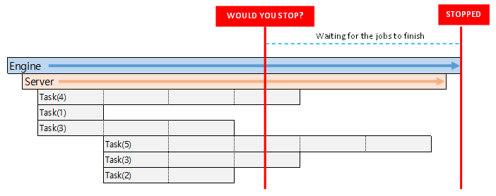

# hippo

The `hippo` helps servers start up safely and shut down gracefully.

[](https://travis-ci.org/devplayg/hippo)
[](https://goreportcard.com/report/github.com/devplayg/hippo)




Import it in your program as:

```go
import "github.com/devplayg/hippo/v3"
```


## 1. Simple server 

Simple server;
[Example](https://github.com/devplayg/hippo/blob/master/examples/simple/main.go)

```go
func main() {
    hippo := hippo.NewHippo(&Server{}, nil)
    if err := hippo.Start(); err != nil {
        panic(err)
    }
}

// Server
type Server struct {
    hippo.Launcher // DO NOT REMOVE; Launcher links server and hippo each other.
}

func (s *Server) Start() error {
    return nil
}

func (s *Server) Stop() error {
    return nil
}
```

```
hippo has been started
    server has been started
    server has been stopped
hippo has been stopped
```


## 2. Normal server

Shutting down the server gracefully;
[Example](https://github.com/devplayg/hippo/blob/master/examples/normal/main.go) 

```go
func main() {
    hippo := hippo.NewHippo(&Server{}, nil)
    if err := hippo.Start(); err != nil {
        panic(err)
    }
}

type Server struct {
    hippo.Launcher // DO NOT REMOVE; Launcher links server and hippo each other.
}

func (s *Server) Start() error {
    s.Log.Print("server has been started")

    for {
        // repetitive work
        s.Log.Print("working on it")
        
        // Intentional error
        return errors.New("intentional error")
        
        select {
        case <-s.Ctx.Done(): // for gracefully shutdown
            s.Log.Print("hippo asked me to stop working")
            return nil
        case <-time.After(2 * time.Second):
        }
    }
}

func (s *Server) Stop() error {
    s.Log.Print("server has been stopped")
return nil
}

```

Output 

```
hippo has been started
  server has been started
    working on it
    an error occurred while the server was running: intentional error
  server has been stopped
hippo has been stopped
```
    
    
## 3. Server working with HTTP Server

Shutting down the server including HTTP server; 
[Example](https://github.com/devplayg/hippo/blob/master/examples/http/main.go)

Output 

```
hippo has been started
    http server has been started
    server has been started
        repetitive work
        repetitive work
        repetitive work
        received signal, shutting down..
    server has been stopped
    http server has been stopped
hippo has been stopped
```
    
    
## 4. Multiple servers

Shutting down multiple servers gracefully;
[Example](https://github.com/devplayg/hippo/blob/master/examples/multiple/main.go)

Output

```
hippo has been started
    all servers has been started
        http server has been started
        server-1 has been started
        server-1 has been started
            server-2 is working on it
            server-1 is working on it
            server-1 is working on it
            server-2 is working on it
            received signal, shutting down..
            server-2 canceled; no longer works
            server-1 canceled; no longer works
        server-2 has been stopped
        server-1 has been stopped
        http server has been stopped
    all server has been stopped
hippo has been stopped
```


## 5. Server with [Logrus](https://github.com/sirupsen/logrus)


```go
func main() {
    hippo := hippo.NewHippo(&Server{}, &hippo.Config{
        Logger: logrus.New(),
    })
    if err := hippo.Start(); err != nil {
        panic(err)
    }
}
```