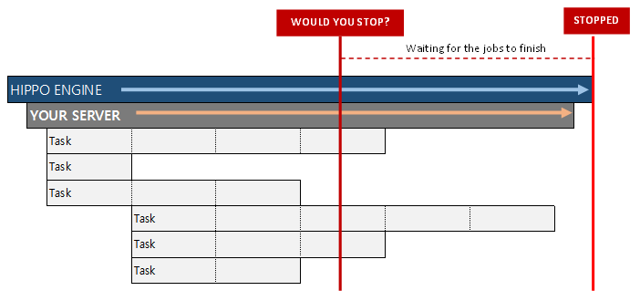

# hippo

The `hippo` helps servers start up safely and shut down gracefully.

[](https://travis-ci.org/devplayg/hippo)
[](https://goreportcard.com/report/github.com/devplayg/hippo)


Import it in your program as:

```go
import "github.com/devplayg/hippo/v2"
```

(Would you stop GRACEFULLY?)



## 1. Simple server 

Simple server;
[Example](https://github.com/devplayg/hippo/blob/master/examples/simple/main.go)

```go
engine := hippo.NewEngine(&Server{}, nil)
    if err := engine.Start(); err != nil {
    panic(err)
}

// Server
type Server struct {
	hippo.Launcher // DO NOT REMOVE; Launcher links server and engine each other.
}

func (s *Server) Start() error {
	return nil
}

func (s *Server) Stop() error {
	return nil
}
```

```
2021/07/04 00:23:46 hippo has been started
2021/07/04 00:23:46     server has been started
2021/07/04 00:23:46     server has been stopped
2021/07/04 00:23:46 hippo has been stopped
```


## 2. Normal server

Shutting down the server gracefully;
[Example](https://github.com/devplayg/hippo/blob/master/examples/normal/main.go) 

```go
func main() {
    engine := hippo.NewHippo(&Server{}, nil)
    if err := engine.Start(); err != nil {
        panic(err)
    }
}

type Server struct {
    hippo.Launcher // DO NOT REMOVE; Launcher links server and engine each other.
}

func (s *Server) Start() error {
    s.Log.Print("server has been started")

    for {
        // repetitive work
        s.Log.Print("working on it")
        
        // Intentional error
        return errors.New("intentional error")
        
        select {
        case <-s.Ctx.Done(): // for gracefully shutdown
            s.Log.Print("hippo asked me to stop working")
            return nil
        case <-time.After(2 * time.Second):
        }
    }
}

func (s *Server) Stop() error {
s.Log.Print("server has been stopped")
return nil
}

```

Output structure

```
2021/07/04 00:35:05 hippo has been started
2021/07/04 00:35:05   server has been started
2021/07/04 00:35:05     working on it
2021/07/04 00:35:05     an error occurred while the server was running: intentional error
2021/07/04 00:35:05   server has been stopped
2021/07/04 00:35:05 hippo has been stopped
```
    
    
## 3. Server working with HTTP Server

Shutting down the server including HTTP server; 
[Example](https://github.com/devplayg/hippo/blob/master/examples/http/main.go)

Output structure

2021/07/04 00:58:40 hippo has been started
2021/07/04 00:58:40    waiting..
2021/07/04 00:58:40    http server has been started
2021/07/04 00:58:40    repetitive work
2021/07/04 00:58:42    repetitive work
2021/07/04 00:58:44    repetitive work
2021/07/04 00:58:45    received signal, shutting down..
2021/07/04 00:58:45    hippo asked to stop repetitive tasks
2021/07/04 00:58:45    hippo asked to stop web server
2021/07/04 00:58:45    server has been stopped
2021/07/04 00:58:45 hippo has been stopped
    
    
## 4. Multiple servers

Shutting down multiple servers gracefully;
[Example](https://github.com/devplayg/hippo/blob/master/examples/multiple/main.go)

Output structure

    engine has been started
        HTTP server has been started
        server-1 has been started
        server-2 has been started
            server-1 is working on it
            server-2 is working on it
                received signal, shutting down..
            server-2 canceled; no longer works
            server-1 canceled; no longer works
        server-1 has been stopped
        server-2 has been stopped
        HTTP server has been stopped
    engine has been stopped
